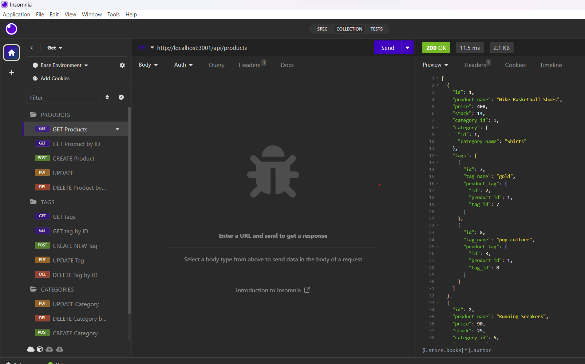

# E-Commerce

## video

## Table of Contents
- [Description](#description)
- [Technologies](#technologies)
- [Installation](#installation)
- [Usage](#usage)
- [API Routes](#api-routes)
- [Contributing](#contributing)
- [License](#license)

## Description
The E-Commerce Backend is the server-side component of an internet retail company's e-commerce website. It provides API routes to manage categories, products, and tags. It's built using Express.js and Sequelize, making it a robust and efficient backend for your e-commerce application.

## Technologies
- Express.js: A web application framework for Node.js that simplifies the creation of APIs and routes.
- Sequelize: An ORM (Object-Relational Mapping) library for Node.js, used to interact with the MySQL database.
- MySQL: The relational database used to store data.

## Installation
To set up the E-Commerce Backend on your local machine, follow these steps:

1. Clone this repository to your local machine:

git clone https://github.com/Fiqre-Ab/E-Commerce

2. Navigate to the project directory:

cd ecommerce-backend

3. Install project dependencies:
npm install

4. Create a MySQL database and configure your environment variables by creating a `.env` file in the project's root directory. Update the following variables with your database information:

DB_NAME=yourdatabase
DB_USER=yourusername
DB_PASSWORD=yourpassword

5. Seed the database with test data by running the following command:
npm run db:seed

## Usage
To start the E-Commerce Backend, run the following command:

npm start

This will start the server and sync the Sequelize models with the MySQL database.

## API Routes
The E-Commerce Backend provides the following API routes:

- **GET** `/api/categories`: Retrieve a list of categories in JSON format.
- **GET** `/api/products`: Retrieve a list of products in JSON format.
- **GET** `/api/tags`: Retrieve a list of tags in JSON format.
- **POST** `/api/categories`: Create a new category.
- **POST** `/api/products`: Create a new product.
- **POST** `/api/tags`: Create a new tag.
- **PUT** `/api/categories/:id`: Update a category by ID.
- **PUT** `/api/products/:id`: Update a product by ID.
- **PUT** `/api/tags/:id`: Update a tag by ID.
- **DELETE** `/api/categories/:id`: Delete a category by ID.
- **DELETE** `/api/products/:id`: Delete a product by ID.
- **DELETE** `/api/tags/:id`: Delete a tag by ID.

You can test these routes using tools like Insomnia or Postman.

## Contributing
If you'd like to contribute to this project, please fork the repository, create a new branch for your changes, and submit a pull request. Your contributions are welcome!

## License
This project is licensed under the MIT License. For details, see the [LICENSE.md](LICENSE.md) file.

---

Feel free to customize this README with additional information about your project, usage examples, and any specific guidelines for contributors. Good luck with your E-Commerce Backend project!

